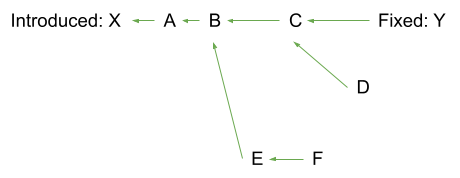

**Version 1.6.6 (Sep 12, 2024)**

Original authors:
- Oliver Chang (ochang@google.com)
- Russ Cox (rsc@google.com)

# Purpose

This document defines a standard interchange format for describing
vulnerabilities in open source packages.

We hope to define a simple format that all vulnerability databases can export,
to make it easier for users, security researchers, and any other efforts to
consume all available databases. Use of this format would also make it easier
for the databases themselves to share or cross-check information. Ultimately,
this format aims to enable automated, accurate, and distributed management
of vulnerabilities in open source dependencies.

This format is stable, but further backwards compatible changes may still be made.
Feedback from maintainers of other vulnerability databases and security response teams
is most welcome. Please feel free to create an
[issue in this repo](https://github.com/ossf/osv-schema/issues/new).

The current list of databases exporting this format can be found
[here](#id-modified-fields).

# Format Overview

The format is a JSON-based encoding format, using the following informal schema.
The exact details of each field are elaborated in the next section. All strings
contain UTF-8 text.

A JSON Schema for validation is also available
[here](https://github.com/ossf/osv-schema/blob/main/validation/schema.json).

```json
{
	"schema_version": string,
	"id": string,
	"modified": string,
	"published": string,
	"withdrawn": string,
	"aliases": [ string ],
	"related": [ string ],
	"summary": string,
	"details": string,
	"severity": [ {
		"type": string,
		"score": string
	} ],
	"affected": [ {
		"package": {
			"ecosystem": string,
			"name": string,
			"purl": string
		},
		"severity": [ {
			"type": string,
			"score": string
		} ],
		"ranges": [ {
			"type": string,
			"repo": string,
			"events": [ {
				"introduced": string,
				"fixed": string,
				"last_affected": string,
				"limit": string
			} ],
			"database_specific": { see description }
		} ],
		"versions": [ string ],
		"ecosystem_specific": { see description },
		"database_specific": { see description }
	} ],
	"references": [ {
		"type": string,
		"url": string
	} ],
	"credits": [ {
		"name": string,
		"contact": [ string ],
		"type": string
	} ],
	"database_specific": { see description }
}
```

Again, this document is only about the JSON encoding the database serves to
consumers, which could be applications or other databases. A database might
store its entries in an entirely different format, or it might store them using
this schema but in a more human-editable encoding, such as TOML or YAML. For
serving, only the JSON encoding format is allowed,
not a transliteration into any other encoding.

Overall, the approach of this schema is to define only the fields that
absolutely must be shared between databases, leaving customizations to the
"ecosystem_specific" and "database_specific" blocks (see below)

# Field Details

## schema_version field

```json
{
	"schema_version": string
}
```

The `schema_version` field is used to indicate which version of the OSV schema
a particular vulnerability was exported with. This can help consumer applications
decide how to import the data for their own systems and offer some protection
against future breaking changes. The value should be a string matching the OSV
Schema version, which follows the [SemVer 2.0.0](https://semver.org) format, with
no leading "v" prefix. If no value is specified, it should be assumed to be `1.0.0`,
matching version 1.0 of the OSV Schema. Clients can assume that new minor and patch
versions of the schema only add new fields, without changing the meaning of old
fields, so that a client that knows how to read version 1.2.0 can process data
identifying as schema version 1.3.0 by ignoring any unexpected fields.

## id, modified fields

```json
{
	"id": string,
	"modified": string
}
```

The `id` field is a unique identifier for the vulnerability entry. It is a
string of the format `<DB>-<ENTRYID>`, where `DB` names the database and
`ENTRYID` is in the format used by the database. For example: "OSV-2020-111",
"CVE-2021-3114", or "GHSA-vp9c-fpxx-744v".

The defined database prefixes and their "home" databases are:

<!-- Unfortunately, markdown tables are even worse than this to read/write -->
<!-- Please keep this list alphabetically sorted -->

<table>
  <thead>
    <tr>
      <th>Prefix</th>
      <th>Database</th>
      <th>Description</th>
    </tr>
  </thead>
  <tbody>
    <tr>
      <td><code>`ASB-A`/`PUB-A`</code></td>
      <td><a href="https://source.android.com/docs/security/bulletin">Android Security Bulletin</a></td>
      <td>
        <ul>
          <li>How to contribute: <a href="https://bughunters.google.com/about/rules/android-friends/6171833274204160/android-and-google-devices-security-reward-program-rules">Android Vulnerability Rewards Program</a></li>
          <li>Source URL: <a href="https://storage.googleapis.com/android-osv/index.html"><code>https://storage.googleapis.com/android-osv/&lt;ID&gt;.json</code></a></li>
          <li>OSV Formatted URL: <code>https://storage.googleapis.com/android-osv/&lt;ID&gt;.json</code></li>
        </ul>
      </td>
    </tr>
    <tr>
      <td><code>ALSA</code>/<code>ALBA</code>/<code>ALEA</code></td>
      <td><a href="https://errata.almalinux.org/">AlmaLinux Security Advisory</a></td>
      <td>
        <ul>
          <li>How to contribute: TBD</li>
          <li>Source URL: <code>https://errata.almalinux.org/&lt;alma version&gt;/&lt;ID&gt;.html</code></li>
          <li>OSV Formatted URL: <code>N/A</code></li>
        </ul>
      </td>
    </tr>
    <tr>
      <td><code>BIT</code></td>
      <td><a href="https://github.com/bitnami/vulndb">Bitnami Vulnerability Database</a></td>
      <td>
        <ul>
          <li>How to contribute: <a href="https://github.com/bitnami/vulndb/blob/main/CONTRIBUTING.md">https://github.com/bitnami/vulndb/blob/main/CONTRIBUTING.md</a></li>
          <li>Source URL: <code>https://github.com/bitnami/vulndb/blob/main/data/&lt;component&gt;/&lt;ID&gt;.json</code></li>
          <li>OSV Formatted URL: <code>N/A</code></li>
        </ul>
      </td>
    </tr>
    <tr>
      <td><code>CGA</code></td>
      <td><a href="https://packages.cgr.dev/chainguard/osv/all.json">Chainguard Security Notices</a></td>
      <td>
        <ul>
          <li>How to contribute: TBD</li>
          <li>Source URL: TBD</li>
          <li>OSV Formatted URL: <code>https://packages.cgr.dev/chainguard/osv/&lt;ID&gt;.json</code></li>
        </ul>
      </td>
    </tr>
    <tr>
      <td><code>CURL</code></td>
      <td><a href="https://curl.se/docs/security.html">Curl CVEs</a></td>
      <td>
        <ul>
          <li>How to contribute: TBD</li>
          <li>Source URL: <code>https://curl.se/docs/&lt;ID&gt;.html</code></li>
          <li>OSV Formatted URL: <code>https://curl.se/docs/&lt;ID&gt;.json</code></li>
        </ul>
      </td>
    </tr>
    <tr>
      <td><code>CVE</code></td>
      <td><a href="https://nvd.nist.gov/">National Vulnerability Database (provided by OSV.dev)</a></td>
      <td>
        <ul>
          <li>How to contribute: TBD</li>
          <li>Source URL: <code>https://nvd.nist.gov/vuln/detail/&lt;ID&gt;</code></li>
          <li>OSV Formatted URL: <code>https://api.osv.dev/v1/vulns/&lt;ID&gt;</code></li>
        </ul>
      </td>
    </tr>
    <tr>
      <td><code>DSA</code>/<code>DLA</code>/<code>DTSA</code></td>
      <td><a href="https://www.debian.org/security/">Debian Security Advisory Database (provided by OSV.dev)</a></td>
      <td>
        <ul>
          <li>How to contribute: TBD</li>
          <li>Source URL: <code>https://debian.org/security/&lt;YEAR&gt;/&lt;ID&gt;</code> (lowercase dsa)</li>
          <li>OSV Formatted URL: <code>https://api.osv.dev/v1/vulns/&lt;ID&gt;</code></li>
        </ul>
      </td>
    </tr>
    <tr>
      <td><code>ELA</code></td>
      <td><a href="https://www.freexian.com/lts/extended/">Debian Extended LTS Security Advisories (provided by Freexian)</a></td>
      <td>
        <ul>
          <li>How to contribute: <a href="https://github.com/captn3m0/debian-elts-advisories/#contributing">https://github.com/captn3m0/debian-elts-advisories/#contributing</a></li>
          <li>Source URL: <code>https://deb.freexian.com/extended-lts/tracker/&lt;ID&gt;</code></li>
          <li>OSV Formatted URL: <code>https://captnemo.in/debian-elts-advisories/advisories/&lt;ID&gt;.json</code></li>
        </ul>
      </td>
    </tr>
    <tr>
      <td><code>GHSA</code></td>
      <td><a href="https://github.com/github/advisory-database">GitHub Security Advisory Database</a></td>
      <td>
        <ul>
          <li>How to contribute: <a href="https://github.com/github/advisory-database#contributions">https://github.com/github/advisory-database#contributions</a></li>
          <li>Source URL: <code>https://github.com/advisories/&lt;ID&gt;</code></li>
          <li>OSV Formatted URL: <code>https://api.osv.dev/v1/vulns/&lt;ID&gt;</code></li>
        </ul>
      </td>
    </tr>
    <tr>
      <td><code>GO</code></td>
      <td><a href="https://pkg.go.dev/vuln/">Go Vulnerability Database</a></td>
      <td>
        <ul>
          <li>How to contribute: <a href="https://github.com/golang/vulndb/issues/new/choose">https://github.com/golang/vulndb/issues/new/choose</a></li>
          <li>Source URL: <code>https://pkg.go.dev/vuln/&lt;ID&gt;</code></li>
          <li>OSV Formatted URL: <code>https://vuln.go.dev/ID/&lt;ID&gt;.json</code></li>
        </ul>
      </td>
    </tr>
    <tr>
      <td><code>GSD</code></td>
      <td><a href="https://github.com/cloudsecurityalliance/gsd-database">Global Security Database</a></td>
      <td>
        <ul>
          <li>How to contribute: TBD</li>
          <li>Source URL: <code>https://gsd.id/&lt;ID&gt;</code></li>
          <li>OSV Formatted URL: <code>https://api.gsd.id/&lt;ID&gt;</code></li>
        </ul>
      </td>
    </tr>
    <tr>
      <td><code>HSEC</code></td>
      <td><a href="https://github.com/haskell/security-advisories">Haskell Security Advisory Database</a></td>
      <td>
        <ul>
          <li>How to contribute: <a href="https://github.com/haskell/security-advisories/blob/main/CONTRIBUTING.md">https://github.com/haskell/security-advisories/blob/main/CONTRIBUTING.md</a></li>
          <li>Source URL: <code>TBD</code></li>
          <li>OSV Formatted URL: <code>https://raw.githubusercontent.com/haskell/security-advisories/main/advisories/&lt;ID&gt;.json</code></li>
        </ul>
      </td>
    </tr>
    <tr>
      <td><code>LBSEC</code></td>
      <td><a href="https://github.com/loopbackio/security/tree/main/advisories">LoopBack Advisory Database</a></td>
      <td>
        <ul>
          <li>How to contribute: TBD</li>
          <li>Source URL: <code>N/A</code></li>
          <li>OSV Formatted URL: <code>N/A</code></li>
        </ul>
      </td>
    </tr>
    <tr>
      <td><code>MGASA</code></td>
      <td><a href="https://advisories.mageia.org/">Mageia Security Advisories</a></td>
      <td>
        <ul>
          <li>How to contribute: <code>TBD</code></li>
          <li>Source URL: <code>https://advisories.mageia.org/&lt;ID&gt;.html</code></li>
          <li>OSV Formatted URL: <code>https://advisories.mageia.org/&lt;ID&gt;.json</code></li>
        </ul>
      </td>
    </tr>
    <tr>
      <td><code>MAL</code></td>
      <td><a href="https://github.com/ossf/malicious-packages/tree/main/osv/">Malicious Packages Repository</a></td>
      <td>
        <ul>
          <li>How to contribute: <a href="https://github.com/ossf/malicious-packages/blob/main/CONTRIBUTING.md">https://github.com/ossf/malicious-packages/blob/main/CONTRIBUTING.md</a></li>
          <li>Source URL: <code>N/A</code></li>
          <li>OSV Formatted URL: <code>https://api.osv.dev/v1/vulns/&lt;ID&gt;</code></li>
        </ul>
      </td>
    </tr>
    <tr>
      <td><code>OSV</code></td>
      <td><a href="https://osv.dev/list">Advisories allocated by OSV.dev (currently only from OSS-Fuzz)</a></td>
      <td>
        <ul>
          <li>How to contribute: <a href="https://github.com/google/oss-fuzz-vulns/issues">https://github.com/google/oss-fuzz-vulns/issues</a></li>
          <li>Source URL: <code>https://osv.dev/vulnerability/&lt;ID&gt;</code></li>
          <li>OSV Formatted URL: <code>https://api.osv.dev/v1/vulns/&lt;ID&gt;</code></li>
        </ul>
      </td>
    </tr>
    <tr>
      <td><code>PHSA</code></td>
      <td><a href="https://github.com/vmware/photon/wiki/Security-Advisories">VMWare Photon Security Advisory Database</a></td>
      <td>
        <ul>
          <li>How to contribute: <a href="https://github.com/captn3m0/photon-os-advisories#contributing">https://github.com/captn3m0/photon-os-advisories#contributing</a></li>
          <li>Source URL: <code>https://github.com/vmware/photon/wiki/&lt;ID&gt;</code></li>
          <li>OSV Formatted URL: <code>https://github.com/captn3m0/photon-os-advisories/blob/main/advisories/&lt;ID&gt;.json</code> (unofficial)</li>
        </ul>
      </td>
    </tr>
    <tr>
      <td><code>PSF</code></td>
      <td><a href="https://github.com/psf/advisory-database">Python Software Foundation Vulnerability Database</a></td>
      <td>
        <ul>
          <li>How to contribute: <a href="https://github.com/psf/advisory-database/issues">https://github.com/psf/advisory-database/issues</a></li>
          <li>Source URL: <code>TBD</code></li>
          <li>OSV Formatted URL: <code>TBD</code></li>
        </ul>
      </td>
    </tr>
    <tr>
      <td><code>PYSEC</code></td>
      <td><a href="https://github.com/pypa/advisory-db">PyPI Vulnerability Database</a></td>
      <td>
        <ul>
          <li>How to contribute: <a href="https://github.com/pypa/advisory-database/issues">https://github.com/pypa/advisory-database/issues</a></li>
          <li>Source URL: <code>https://osv.dev/vulnerability/&lt;ID&gt;</code></li>
          <li>OSV Formatted URL: <code>https://api.osv.dev/v1/vulns/&lt;ID&gt;</code></li>
        </ul>
      </td>
    </tr>
    <tr>
      <td><code>RHSA</code>/<code>RHBA</code>/<code>RHEA</code></td>
      <td><a href="https://security.access.redhat.com/data">Red Hat Security Data</a></td>
      <td>
        <ul>
          <li>How to contribute: <a href="https://access.redhat.com/security/team/contact/">https://access.redhat.com/security/team/contact/</a></li>
          <li>Source URL: <code>https://access.redhat.com/security/security-updates/security-advisories</code></li>
          <li>OSV Formatted URL: <code>https://security.access.redhat.com/data/osv/</code></li>
        </ul>
      </td>
    </tr>
    <tr>
      <td><code>RLSA</code>/<code>RXSA</code></td>
      <td><a href="https://errata.rockylinux.org">Rocky Linux Security Advisory Database</a></td>
      <td>
        <ul>
          <li>How to contribute: TBD</li>
          <li>Source URL: <code>https://errata.rockylinux.org/&lt;ID&gt;</code></li>
          <li>OSV Formatted URL: <code>https://apollo.build.resf.org/api/v3/osv/&lt;ID&gt;</code></li>
        </ul>
      </td>
    </tr>
    <tr>
      <td><code>RSEC</code></td>
      <td><a href="https://github.com/RConsortium/r-advisory-database">RConsortium Advisory Database</a></td>
      <td>
        <ul>
          <li>How to contribute: <a href="https://github.com/RConsortium/r-advisory-database#readme">https://github.com/RConsortium/r-advisory-database#readme</a></li>
          <li>Source URL: <code>https://osv.dev/vulnerability/&lt;ID&gt;</code></li>
          <li>OSV Formatted URL: <code>https://github.com/RConsortium/r-advisory-database/blob/main/vulns/&lt;package&gt;/&lt;ID&gt;.yaml</code></li>
        </ul>
      </td>
    </tr>
    <tr>
      <td><code>RUSTSEC</code></td>
      <td><a href="https://github.com/rustsec/advisory-db">RustSec Advisory Database</a></td>
      <td>
        <ul>
          <li>How to contribute: <a href="https://github.com/RustSec/advisory-db/blob/main/CONTRIBUTING.md">https://github.com/RustSec/advisory-db/blob/main/CONTRIBUTING.md</a></li>
          <li>Source URL: <code>https://rustsec.org/advisories/&lt;ID&gt;</code></li>
          <li>OSV Formatted URL: <code>https://raw.githubusercontent.com/rustsec/advisory-db/osv/crates/&lt;ID&gt;.json</code></li>
        </ul>
      </td>
    </tr>
    <tr>
      <td><code>SUSE-SU</code>, <code>SUSE-RU</code>, <code>SUSE-FU</code>, <code>SUSE-OU</code> and <code>openSUSE-SU</code></td>
      <td><a href="https://www.suse.com/support/security/">SUSE Security Landing page</a></td>
      <td>
        <ul>
          <li>How to contribute: <a href="https://www.suse.com/support/security/contact/">https://www.suse.com/support/security/contact/</a></li>
          <li>Source URL: <code>https://www.suse.com/support/update/</code></li>
          <li>OSV Formatted URL: <code>https://ftp.suse.com/pub/projects/security/osv/</code></li>
        </ul>
      </td>
    </tr>
    <tr>
      <td><code>UBUNTU</code></td>
      <td><a href="https://ubuntu.com/security/cves">Ubuntu CVE Reports</a></td>
      <td>
        <ul>
          <li>How to contribute: TBD</li>
          <li>Source URL: <code>https://ubuntu.com/security/&lt;ID&gt;</code></li>
          <li>OSV Formatted URL: <code>https://github.com/canonical/ubuntu-security-notices/blob/main/osv/cve/&lt;YEAR&gt;/UBUNTU-&lt;ID&gt;.json</code></li>
        </ul>
      </td>
    </tr>
    <tr>
      <td><code>USN</code></td>
      <td><a href="https://ubuntu.com/security/notices">Ubuntu Security Notices</a></td>
      <td>
        <ul>
          <li>How to contribute: TBD</li>
          <li>Source URL: <code>https://ubuntu.com/security/notices/&lt;ID&gt;</code></li>
          <li>OSV Formatted URL: <code>https://github.com/canonical/ubuntu-security-notices/blob/main/osv/usn/&lt;ID&gt;.json</code></li>
        </ul>
      </td>
    </tr>
    <tr>
      <td>Your database here</td>
      <td colspan="2"><a href="https://github.com/ossf/osv-schema/compare">Send us a PR</a></td>
    </tr>
  </tbody>
</table>

In addition to those prefixes, other databases may serve information about
non-database-specific prefixes. For example a language ecosystem might decide to
use CVE identifiers to index its database rather than a custom prefix. The known
databases operating without custom identifier prefixes are:

- Alpine Security Advisory. Serving `<ID>` in the shared format at `https://storage.googleapis.com/cve-osv-conversion/osv-output/<ID>.json`.
- Your database here. [Send us a PR](https://github.com/ossf/osv-schema/compare).

The `modified` field gives the time the entry was last modified, as an
RFC3339-formatted timestamp in UTC (ending in "Z"). Given two
different entries claiming to describe the same `id` field, the one with the
later modification time is considered authoritative.

The `id` and `modified` fields are required. For schema versions above 1.0.0,
the `schema_version` field is also required. All other fields are optional,
although of course an entry with no other metadata is not particularly useful.
(It could potentially stand for a reserved ID with no other public information.)

## published field

```json
{
	"published": string
}
```

The `published` field gives the time the entry should be considered to have been
published, as an RFC3339-formatted time stamp in UTC (ending in "Z").

## withdrawn field

```json
{
	"withdrawn": string
}
```

The `withdrawn` field gives the time the entry should be considered to have been
withdrawn, as an RFC3339-formatted timestamp in UTC (ending in "Z"). If the
field is missing, then the entry has not been withdrawn. Any rationale for why
the vulnerability has been withdrawn should go into the summary text.

## aliases field

```json
{
	"aliases": [ string ]
}
```

The `aliases` field gives a list of IDs of the same vulnerability in other
databases, in the form of the `id` field. This allows one database to claim that
its own entry describes the same vulnerability as one or more entries in other
databases.

Two vulnerabilities can be described as aliases if they affect any given
software component the same way: either both vulnerabilities affect the software
component or neither do. A subsequent patch addresses both of the
vulnerabilities (and no others), and vice versa.

Aliases should be considered symmetric (if A is an alias of B, then B is an
alias of A) and transitive (If A aliases B and B aliases C, then A aliases C).

Aliases should **not** be used to refer to vulnerabilities in packages upstream
or downstream in a software supply chain from the given OSV record's affected
package(s). For example, if a CVE describes a vulnerability in a language
library, and a Linux distribution package contains that library and therefore
publishes an advisory, the distribution's OSV record must not list the CVE ID as
an alias. Similarly, distributions often bundle multiple upstream
vulnerabilities into a single record. `related` should be used in these cases.

## related field

```json
{
	"related": [ string ]
}
```

The `related` field gives a list of IDs of closely related vulnerabilities, such
as:
- A similar but completely different vulnerability.
- A similar OSV entry that bundles multiple distinct vulnerabilities in the same
entry.
- Cases that do not satisfy the strict definition of `aliases`.

Related vulnerabilities are symmetric but not transitive.

## summary, details fields

```json
{
	"summary": string,
	"details": string
}
```

The `summary` field gives a one-line, English textual summary of the
vulnerability. It is recommended that this field be kept short, on the order of
no more than 120 characters.

The `details` field gives additional English textual details about the
vulnerability.

The `summary` field is plain text.

The `details` field is CommonMark markdown (a subset of GitHub-Flavored
Markdown). Display code may at its discretion sanitize the input further, such
as stripping raw HTML and links that do not start with http:// or https://.
Databases are encouraged not to include those in the first place. (The goal is
to balance flexibility of presentation with not exposing vulnerability database
display sites to unnecessary vulnerabilities.)

## severity field

```json
{
	"severity": [ {
		"type": string,
		"score": string
	} ]
}
```

The `severity` field is a JSON array that allows generating systems to describe
the severity of a vulnerability using one or more quantitative scoring methods.
Each `severity` item is a JSON object specifying a `type` and `score` property,
described below.

### severity[].type field

The `severity[].type` property must be one of the types defined below, which
describes the quantitative method used to calculate the associated `score`.

| Severity Type | Score Description |
| --------- | ----------- |
| `CVSS_V2` | A CVSS vector string representing the unique characteristics and severity of the vulnerability using a version of the [Common Vulnerability Scoring System notation](https://www.first.org/cvss/v2/) that is == 2.0 (e.g.`"AV:L/AC:M/Au:N/C:N/I:P/A:C"`).|
| `CVSS_V3` | A CVSS vector string representing the unique characteristics and severity of the vulnerability using a version of the [Common Vulnerability Scoring System notation](https://www.first.org/cvss/) that is >= 3.0 and < 4.0 (e.g.`"CVSS:3.1/AV:N/AC:H/PR:N/UI:N/S:C/C:H/I:N/A:N"`).|
| `CVSS_V4` | A CVSS vector string representing the unique characterictics and severity of the vulnerability using a version on the [Common Vulnerability Scoring System notation](https://www.first.org/cvss/) that is >= 4.0 and < 5.0 (e.g. `"CVSS:4.0/AV:N/AC:L/AT:N/PR:H/UI:N/VC:L/VI:L/VA:N/SC:N/SI:N/SA:N"`). |
| Your quantitative severity type here. | [Send us a PR](https://github.com/ossf/osv-schema/compare). |

### severity[].score field

The `severity[].score` property is a string representing the severity score based
on the selected `severity[].type`, as described above.

## affected fields

```json
{
	"affected": [ {
		"package": {
			"ecosystem": string,
			"name": string,
			"purl": string
		},
		"severity": [ {
			"type": string,
			"score": string
		} ],
		"ranges": [ {
			"type": string,
			"repo": string,
			"events": [ {
				"introduced": string,
				"fixed": string,
				"last_affected": string,
				"limit": string
			} ]
		} ],
		"versions": [ string ],
		"ecosystem_specific": { see description },
		"database_specific": { see description }
	} ]
}
```

The `affected` field is a JSON array containing objects that describes the
affected package versions, meaning those that contain the vulnerability.

Within each object in the `affected` array, the `package` field identifies the
package containing the vulnerability. In most cases, there should be exactly one
entry in the `affected` array per affected `package` to describe all affected
versions. In rare cases, for example if the `ecosystem_specific` encodes
platform information that doesn't apply equally to all listed versions and
ranges, a separate entry with the same `package` in the `affected` array may be
needed.

The `versions` field can enumerate a specific set of affected versions, and the
`ranges` field can list ranges of affected versions, under a given defined
ordering. **A version is considered affected if it lies within any one of the
ranges or is listed in the versions list.** Pseudocode for evaluating if a
given version is affected is available [here](#evaluation).

The `versions` list is generally recommended to always be present, to allow
software to easily answer the question "is this specific version affected?"
without having to contain code specific to every different ecosystem. If the
affected versions can be accurately summarized by one or more non-overlapping
ranges, they may be encoded using the `ranges` field with an appropriate type
(see below). In this case, the ranges act as a kind of compact form of a larger
`versions` list. Tooling and infrastructure such as https://osv.dev are able to
expand these ranges for supported ecosystems into the `versions` list for easier
consumption. Products or ecosystems that do not use version identifiers that can
be represented as ranges must include the enumerated `versions` list instead.

### affected[].package field

The `affected` object's `package` field is a JSON object identifying the
affected code library or command provided by the package. The object itself has
two required fields, `ecosystem` and `name`, and an optional `purl` field.

The `ecosystem` identifies the overall library ecosystem. It must be one of the
strings in the table below. The `name` field is a string identifying the library
within its ecosystem. The two fields must both be present, because the
`ecosystem` serves to define the interpretation of the `name`.

The `purl` field is a string following the
 [Package URL specification](https://github.com/package-url/purl-spec) that
identifies the package. This field is optional but recommended.

Different ecosystems can define the same names; they identify different
packages. For example, these denote different libraries with different sets of
versions and different potential vulnerabilities:

```json
{"ecosystem": "npm", "name": "zlib"}
```

```json
{"ecosystem": "PyPI", "name": "zlib"}
```

<!-- Please keep this list alphabetically sorted -->
The defined ecosystems are:

| Ecosystem | Description  |
| --------- |-----------------|
| `AlmaLinux` | AlmaLinux package ecosystem; the `name` is the name of the source package. The ecosystem string might optionally have a `:<RELEASE>` suffix to scope the package to a particular AlmaLinux release. `<RELEASE>` is a numeric version.
| `Alpine` | The Alpine package ecosystem; the `name` is the name of the source package. The ecosystem string must have a `:v<RELEASE-NUMBER>` suffix to scope the package to a particular Alpine release branch (the `v` prefix is required). E.g. `v3.16`. |
| `Android`  | The Android ecosystem. Android organizes code using [`repo` tool](https://gerrit.googlesource.com/git-repo/+/HEAD/README.md), which manages multiple git projects under one or more remote git servers, where each project is identified by its name in [repo configuration](https://gerrit.googlesource.com/git-repo/+/HEAD/docs/manifest-format.md#Element-project) (e.g. `platform/frameworks/base`). The `name` field should contain the name of that affected git project/submodule. One exception is when the project contains the Linux kernel source code, in which case `name` field will be `:linux_kernel:`, followed by an optional SoC vendor name e.g. `:linux_kernel:Qualcomm`. The list of recognized SoC vendors is listed in the [Appendix](#android-soc-vendors) |
| `Bioconductor` | The biological R package ecosystem. The `name` is an R package name. |
| `Bitnami` | Bitnami package ecosystem; the `name` is the name of the affected component. |
| `Chainguard` | The Chainguard package ecosystem; the `name` is the name of the package. |
| `ConanCenter` | The ConanCenter ecosystem for C and C++; the `name` field is a Conan package name.  |
| `CRAN` | The R package ecosystem. The `name` is an R package name. |
| `crates.io` | The crates.io ecosystem for Rust; the `name` field is a crate name.  |
| `Debian` | The Debian package ecosystem; the `name` is the name of the source package. The ecosystem string might optionally have a `:<RELEASE>` suffix to scope the package to a particular Debian release. `<RELEASE>` is a numeric version specified in the [Debian distro-info-data](https://debian.pages.debian.net/distro-info-data/debian.csv). For example, the ecosystem string "Debian:7" refers to the Debian 7 (wheezy) release.  |
| `GHC` | The Haskell compiler ecosystem. The `name` field is the name of a component of the GHC compiler ecosystem (e.g., compiler, GHCI, RTS).  |
| `GitHub Actions` | The GitHub Actions ecosystem; the `name` field is the action's repository name with owner e.g. `{owner}/{repo}`. |
| `Go` | The Go ecosystem; the `name` field is a Go module path.  |
| `Hackage` | The Haskell package ecosystem. The `name` field is a Haskell package name as published on Hackage.  |
| `Hex` | The package manager for the Erlang ecosystem; the `name` is a Hex package name.  |
| `Linux` | The Linux kernel. The only supported `name` is `Kernel`. |
| `Mageia` | The Mageia Linux package ecosystem; the `name` is the name of the source package. The ecosystem string must have a `:<RELEASE-NUMBER>` suffix to scope the package to a particular Mageia release. Eg `Mageia:9`. |
| `Maven` | The Maven Java package ecosystem. The `name` field is a Maven package name in the format `groupId:artifactId`. The ecosystem string might optionally have a `:<REMOTE-REPO-URL>` suffix to denote the remote repository URL that best represents the source of truth for this package, without a trailing slash (e.g. `Maven:https://maven.google.com`). If this is omitted, this is assumed to be the Maven Central repository (`https://repo.maven.apache.org/maven2`).
| `npm` | The NPM ecosystem; the `name` field is an NPM package name.  |
| `NuGet` | The NuGet package ecosystem. The `name` field is a NuGet package name.  |
| `OSS-Fuzz` | For reports from the OSS-Fuzz project that have no more appropriate ecosystem; the `name` field is the name assigned by the OSS-Fuzz project, as recorded in the submitted fuzzing configuration.  |
| `openSUSE` | The openSUSE ecosystem; The ecosystem string has a `:<RELEASE>` suffix presenting the marketing name of the openSUSE distribution. `<RELEASE>` matches the value in the `/etc/os-release` `PRETTY_NAME` field. The `name` field is the name of the source RPM and accompanied by a purl. There is an `ecosystem_specific` specific array `binaries` of the associated RPM binary packages in this specific openSUSE distribution. The ECOSYSTEM version ordering is the RPM versioncompare ordering, and the database uses the `introduced` and `fixed` boundaries.|
| `Packagist` | The PHP package manager ecosystem; the `name` is a package name.  |
| `Photon OS` | The Photon OS package ecosystem; the `name` is the name of the RPM package. The ecosystem string must have a `:<RELEASE-NUMBER>` suffix to scope the package to a particular Photon OS release. Eg `Photon OS:3.0`. |
| `Pub` | The package manager for the Dart ecosystem; the `name` field is a Dart package name. |
| `PyPI` | the Python PyPI ecosystem; the `name` field is a [normalized](https://www.python.org/dev/peps/pep-0503/#normalized-names) PyPI package name.  |
| `Red Hat` | The Red Hat package ecosystem; the `name` field is the name of a binary or source RPM. The ecosystem string has a `:<CPE>` suffix to scope the RPM to a specific Red Hat product stream. `<CPE>` is a translation of a Red Hat [Common Platform Enumerations](https://cpe.mitre.org/) (CPE) with the `cpe/:[oa]:(redhat):` prefix removed (for example, `Red Hat:rhel_aus:8.4::appstream` translates to `cpe:/a:redhat:rhel_aus:8.4::appstream`). Red Hat ecosystem identifiers can be used to identify vulnerable RPMs installed on a Red Hat system as explained [here](https://www.redhat.com/en/blog/how-accurately-match-oval-security-data-installed-rpms).  |
| `Rocky Linux` | The Rocky Linux package ecosystem; the `name` is the name of the source package. The ecosystem string might optionally have a `:<RELEASE>` suffix to scope the package to a particular Rocky Linux release. `<RELEASE>` is a numeric version.
| `RubyGems` | The RubyGems ecosystem; the `name` field is a gem name.  |
| `SUSE` | The SUSE ecosystem; The ecosystem string has a `:<RELEASE>` suffix representing the marketing name of the SUSE product. `<RELEASE>` matches the value in the /etc/os-release `PRETTY_NAME` field. The `name` field is the name of the source RPM and accompanied by a purl. There is a `ecosystem_specific` specific array `binaries` of the associated RPM binary packages in this specific SUSE product. The ECOSYSTEM version ordering is the RPM versioncompare ordering, and the database uses the `introduced` and `fixed` boundaries.|
| `SwiftURL` | The Swift Package Manager ecosystem. The `name` is a Git URL to the source of the package. Versions are Git tags that comform to [SemVer 2.0](https://docs.swift.org/package-manager/PackageDescription/PackageDescription.html#version). |
| `Ubuntu` | The Ubuntu package ecosystem; the `name` field is the name of the source package. The ecosystem string has a `:<RELEASE>` suffix to scope the package to a particular Ubuntu release. `<RELEASE>` is a numeric ("YY.MM") version as specified in [Ubuntu Releases](https://wiki.ubuntu.com/Releases), with a mandatory `:LTS` suffix if the release is marked as LTS. The release version may also be prefixed with `:Pro:` to denote Ubuntu Pro (aka Expanded Security Maintenance (ESM)) updates. For example, the ecosystem string "Ubuntu:22.04:LTS" refers to Ubuntu 22.04 LTS (jammy), while "Ubuntu:Pro:18.04:LTS" refers to fixes that landed in Ubuntu 18.04 LTS (bionic) under Ubuntu Pro/ESM.
| Your ecosystem here. | [Send us a PR](https://github.com/ossf/osv-schema/compare). |

It is permitted for a database name (the DB prefix in the `id` field) and an
ecosystem name to be the same, provided they have the same owner who can make
decisions about the meaning of the `ecosystem_specific` field (see below).

### affected[].severity field

The `severity` field is an optional element [defined here](#severity-field).
This `severity` field applies to a specific package, in cases where affected
packages have differing severities for the same vulnerability. If any package
level `severity` fields are set, the top level [`severity`](#severity-field)
must not be set.

### affected[].versions field

The `affected` object's `versions` field is a JSON array of strings. Each string
is a single affected version in whatever version syntax is used by the given
package ecosystem.

When there is no well-defined packaging ecosystem specified (for
example, general C/C++ libraries), GIT commit ranges are typically the best way
to define vulnerable version ranges. In this case, versions specified in this
array cannot be relied upon to conform to any particular syntax (e.g. they
could be the upstream Git version tags derived from these GIT commit ranges,
which is what [OSV.dev](https://osv.dev/) populates this field with). In this
situation, the GIT commit ranges in [`affected[].ranges`](#affectedranges-field)
should be used to match vulnerabilities by Git commit hashes.

### affected[].ranges[] field

The `affected` object's `ranges` field is a JSON array of objects describing the
affected ranges of versions.

### affected[].ranges[].type field

In the `ranges` field, the `type` field is required. It specifies the type of
version range being recorded and defines the interpretation of the `events`
object's `introduced`, `fixed`, and any type-specific fields.

The defined types and their additional fields are:

- `SEMVER`: The versions `introduced` and `fixed` are semantic versions as defined
by [SemVer 2.0.0](https://semver.org), with no leading "v" prefix. The relation
`u < v` denotes the precedence order defined in [section 11 of SemVer 2.0](https://semver.org/#spec-item-11).
Ranges listed with type `SEMVER` should not overlap: since SEMVER is a strict
linear ordering, it is always possible to simplify to non-overlapping ranges.

  Specifying one or more `SEMVER` ranges removes the requirement to specify an
explicit enumerated `versions` list (see the discussion above).

  Some ecosystems may recommend using SemVer 2.0 for versioning without explicitly
enforcing it. In those cases you should use the `ECOSYSTEM` type instead.

- `ECOSYSTEM`: The versions `introduced` and `fixed` are arbitrary, uninterpreted
strings specific to the package ecosystem, which does not conform to SemVer
2.0’s version ordering.

  It is recommended that you provide an explicitly enumerated `versions` list when
specifying one or more `ECOSYSTEM` ranges, because `ECOSYSTEM` range inclusion
queries may not be able to be answered without reference to the package ecosystem’s
own logic and therefore may not be able to be used by ecosystem-independent
processors. The infrastructure and tooling provided by https://osv.dev also
provides automation for auto-populating the `versions` list based on supported
`ECOSYSTEM` ranges as part of the ingestion process.

- `GIT`: The versions `introduced` and `fixed` are full-length Git commit
  hashes. The repository’s commit graph is needed to evaluate whether a given
  version is in the range. The relation `u < v` is true when commit `u` is a
  (perhaps distant) parent of commit `v`.

  Specifying one or more `GIT` ranges does NOT remove the requirement to specify
an explicitly enumerated `versions` list, because `GIT` range inclusion queries
cannot be answered without access to a copy of the underlying Git repository.

### affected[].ranges[].events fields

The `ranges` object's `events` field is a JSON array of objects. Each object
describes a single version that either:
1. Introduces a vulnerability: `{"introduced": string}`
2. Fixes a vulnerability: `{"fixed": string}`
3. Describes the last known affected version: `{"last_affected": string}`
4. Sets an upper limit on the range being described: `{"limit": string}`

These `events` objects represent a "timeline" of status changes for the affected
package.

The values of `introduced`, `fixed`, `last_affected` and `limit` are version strings
as defined by the `affected[].ranges[].type` field.

#### Special values

  - `introduced` allows a version of the value `"0"` to represent a version that
    sorts before any other version.
  - `limit` allows versions containing the string `"*"` to represent "infinity".
    If no limit events are provided, an implicit `{ "limit": "*" }` is assumed to
    exist. Multiple `limit` events are allowed in the same range.

#### Requirements

Only **a single type** (either `introduced`, `fixed`, `last_affected`,
`limit`) is allowed in each event object. For instance,
`{"introduced": "1.0.0", "fixed": "1.0.2"}` is **invalid**.

Entries in the `events` array can contain either `last_affected` or `fixed`
events, but not both. It's **strongly recommended** to use `fixed` instead of
`last_affected` where possible, as it precisely identifies the version which
contains the fix. `last_affected` should be thought of as the hard ceiling
of the vulnerability _at the time of publication_ in the absence of a fixed version.
Versions above `last_affected` should be considered unaffected. Unfortunately
this opens up the possibility for false negatives, which is why `fixed` is
overwhelmingly preferred. An [example](#last_affected-vs-fixed-example) is available to
illustrate the difference.

The `fixed` and `limit` events are closely related and involve a similar
trade-off for `GIT` ranges. (See the [limit example](#Limit-events) for details
about how they differ.)  `events` arrays with `fixed` events must include all
other cherrypicked fix commits in all branches as separate `fixed` events to
avoid *false positive* matches in other branches. Conversely, `limit` events
restrict the set of vulnerable commits to those reachable from the `limit`,
which may result in *false negatives*. Where possible, it's strongly
recommended to use `fixed` over `limit`.

There must be at least one `introduced` object in the `events` array. While
not required, it's also recommended to keep the `events` array sorted according
to the `affected[].ranges[].type` of the range.

See [examples](#examples) for examples of how to describe affected ranges.

### affected[].ranges[].repo field

The `ranges` object's `repo` field is the URL of the package's code
repository. The value should be in a format that's directly usable as an
argument for the version control system's clone command (e.g. `git clone`).

The `affected` object's `ranges` field is a JSON array of objects, each
describing a single range.  The range object defines the fields `type`,
`events`, `repo`.  `introduced`, `fixed`, and additional type-specific fields as needed.

This field is required if `affected[].ranges[].type` is `GIT`.

### affected[].ranges[].database_specific field

The `ranges` object's `database_specific` field is a JSON object holding
additional information about the range as defined by the database from which the record was obtained. The
meaning of the values within the object is entirely defined by the database and
beyond the scope of this document.

Databases should only use this field to store additional context that may be useful in converting from the OSV
format back into the original database representation. Values in this field
have no effect on the [evaluation algorithm](#evaluation).

### affected[].ecosystem_specific field

The `affected` object's `ecosystem_specific` field is a JSON object holding
additional information about the vulnerability as defined by the ecosystem for
which the record applies. The meaning of the values within the object is
entirely defined by the ecosystem and beyond the scope of this document.

For example, the Go ecosystem includes here information about the affected
functions and which modules the packages were found in, along with severity in
the Go project-specific severity scale.

Note that this is a single field with key "ecosystem_specific", which itself
contains a JSON object with unspecified fields.

### affected[].database_specific field

The `affected` object's `database_specific` field is a JSON object holding
additional information about the vulnerability as defined by the database from
which the record was obtained. The meaning of the values within the object is
entirely defined by the database and beyond the scope of this document.

In general, the canonical database for a particular ecosystem should record its
information in `ecosystem_specific`, allowing other aggregator databases to put
their own summaries in `database_specific`.

For example, databases that add additional information such as computed CVSS
scores for ecosystems that do not provide them could add that information here.

Note that this is a single field with key "database_specific", which itself
contains a JSON object with unspecified fields.

### Evaluation

The algorithm to evaluate if a package `pkg` at version `v` is vulnerable is
given by the `IsVulnerable` function in the pseudocode below:

```python
func IsVulnerable(pkg, v, osv)
  for affected in osv.affected
    if affected.package == pkg
      if IncludedInVersions(v, affected.versions) ||
           IncludedInRanges(v, affected.ranges)
        return true

  return false

func IncludedInVersions(v, versions)
  for version in versions
    if v == version
      return true

  return false

func IncludedInRanges(v, ranges)
  for range in ranges
    if BeforeLimits(v, range)
      vulnerable = false
      for evt in sorted(range.events)
        if evt.introduced is present && v >= evt.introduced
           vulnerable = true
        else if evt.fixed is present && v >= evt.fixed
           vulnerable = false
        else if evt.last_affected is present && v > evt.last_affected
           vulnerable = false

      if vulnerable
        return true

  return false

func BeforeLimits(v, range)
  if no limit events in range.events
    # implicit "*" entry is assumed
    return true

  for evt in range.events
    if evt.limit is present and v < evt.limit
      return true

  return false

```

### Examples
#### Unfixed vulnerability example
The following expresses that "every possible version is affected".

```json
"ranges": [ {
    "type": "SEMVER",
    "events": [
      { "introduced": "0" },
    ]
} ]
```

#### Fixed vulnerability example
The following expresses that "everything before `1.0.2`" is affected.

```json
"ranges": [ {
    "type": "SEMVER",
    "events": [
      { "introduced": "0" },
      { "fixed": "1.0.2" },
    ]
} ]
```

#### Multiple range example
The following expresses that versions in the SemVer ranges `[1.0.0,
1.0.2)` or `[3.0.0, 3.2.5)` are affected. Everything else is unaffected.

```json
"ranges": [ {
    "type": "SEMVER",
    "events": [
      { "introduced": "1.0.0" },
      { "fixed": "1.0.2" },
      { "introduced": "3.0.0" },
      { "fixed": "3.2.5" }
    ]
} ]
```

#### Limit events
`limit` events are typically not necessary for describing numbered (linear)
version ranges and should not be used. They are more useful for git ranges,
where it has more implications for the evaluation algorithm. Take the following
git commit graph and git range:



```json
"ranges": [ {
    "type": "GIT",
    "repo": "https://github.com/owner/repo",
    "events": [
      { "introduced": "X" },
      { "fixed": "Y" },
    ]
} ]
```

Without an explicit `limit`, the list of computed affected commits will be `X,
A, B, C, D, E, F`. This is the desired behaviour in most cases.

```json
"ranges": [ {
    "type": "GIT",
    "repo": "https://github.com/owner/repo",
    "events": [
      { "introduced": "X" },
      { "limit": "Y" },
    ]
} ]
```

If `limit` is set to `Y`, the list of affected commits will be `X, A, B, C`. This
is equivalent to `git rev-list X..Y` (but including `X` and excluding `Y`).
This may be useful if the scope of a vulnerability entry is limited to a small
set of linear branches. Multiple `limit` events may be specified for each
branch -- each expands the scope of the git commit graph to cover.

Note that we did not specify a `fixed` event here as `limit` makes it redundant.

#### `last_affected` vs `fixed` example
Understanding the difference between `last_affected` and `fixed` is essential to
identifying where false negatives may occur.

The following example expresses that the vulnerability is present in all versions
of the package, up to and including version `2.1.214`. Versions above `2.1.214` are
assumed to be free from the vulnerability, but there is a potential for a false
negative. The `last_affected` field is typically assigned at the time of discovery and
assumes the vulnerability will be addressed in the following version.

```json
"ranges":[ {
    "type":"ECOSYSTEM",
    "events": [
      { "introduced": "0" },
      { "last_affected": "2.1.214" },
    ]
} ]
```

The following example looks similar, but there are differences in how it is interpreted.
The vulnerability is present in all versions of the package up to version `2.1.214`. In
this case `2.1.214` is not vulnerable. Versions `2.1.214` and above do not include the
vulnerability and there isn't the possibility for false negatives that we see in the
`last_affected` case.

```json
"ranges": [ {
    "type": "SEMVER",
    "events": [
      { "introduced": "0" },
      { "fixed": "2.1.214" },
    ]
} ]
```

Using `fixed` is preferable to `last_affected` whenever possible. The use of `fixed`
requires fewer assumptions and eliminates the possibilities for false negatives.

## references field

```json
{
	"references": [ {
		"type": string,
		"url": string
	} ]
}
```

The `references` field contains a list of JSON objects describing references.
Each object has a string field `type` specifying the type of reference, and a
string field `url`. The `url` is the fully-qualified URL (including the scheme,
typically "https://") linking to additional information, advisories, issue
tracker entries, and so on about the vulnerability itself. The `type` specifies
what kind of reference the URL is.

The known reference `type` values are:

- `ADVISORY`: A published security advisory for the vulnerability.
- `ARTICLE`: An article or blog post describing the vulnerability.
- `DETECTION`: A tool, script, scanner, or other mechanism that allows for
  detection of the vulnerability in production environments. e.g. YARA rules,
  hashes, virus signature, or other scanners.
- `DISCUSSION`: A social media discussion regarding the vulnerability, e.g.
  a Twitter, Mastodon, Hacker News, or Reddit thread.
- `REPORT`: A report, typically on a bug or issue tracker, of the vulnerability.
- `FIX`: A source code browser link to the fix (e.g., a GitHub commit) Note that
  the `fix` type is meant for viewing by people using web browsers.  Programs
  interested in analyzing the exact commit range would do better to use the
  `GIT`-typed `affected[].ranges` entries (described above).
- `INTRODUCED`: A source code browser link to the introduction of the vulnerability
  (e.g., a GitHub commit) Note that the `introduced` type is meant for viewing by people using
  web browsers.  Programs interested in analyzing the exact commit range would do better
  to use the `GIT`-typed `affected[].ranges` entries (described above).
- `PACKAGE`: A home web page for the package.
- `EVIDENCE`: A demonstration of the validity of a vulnerability claim, e.g.
	`app.any.run` replaying the exploitation of the vulnerability.
- `WEB`: A web page of some unspecified kind.

## credits fields

```json
{
	"credits": [ {
		"name": string,
		"contact": [ string ],
		"type": string,
	} ]
}
```

The `credits` field is a JSON array providing a way to give credit for the
discovery, confirmation, patch, or other events in the life cycle of a
vulnerability.

Each of the objects in the `credits` array must contain at minimum a `name` field
specifying the name of the individual or entity being credited, using whatever
notation they prefer. It can also optionally include a `contact` JSON array.

### credits[].name field

`credits[].name` should specify the name, label, or other identifier of the
individual or entity being credited, using whatever notation the creditor prefers.
For instance, this could contain a real name like `Kovács János`, an Internet handle
like `erikamustermann`, an entity name like `GitHub`, or something else. This field
is required for each `credits` entry.

### credits[].contact[] field

Each `credits[].contact[]` entry should be a valid, fully qualified, plain-text URL
at which the credited can be reached. Providing contacts is optional.

### credits[].type field

The optional `credits[].type` field should specify the type or role of the
individual or entity being credited. It must be one of the following defined
credit types:

- `FINDER`: identified the vulnerability.
- `REPORTER`: notified the vendor of the vulnerability to a CNA.
- `ANALYST`: validated the vulnerability to ensure accuracy or severity.
- `COORDINATOR`: facilitated the coordinated response process.
- `REMEDIATION_DEVELOPER`: prepared a code change or other remediation plans.
- `REMEDIATION_REVIEWER`: reviewed vulnerability remediation plans or code changes for effectiveness and completeness.
- `REMEDIATION_VERIFIER`: tested and verified the vulnerability or its remediation.
- `TOOL`: names of tools used in vulnerability discovery or identification.
- `SPONSOR`: supported the vulnerability identification or remediation activities.
- `OTHER`: any other type or role that does not fall under the categories described above.

These values and their definitions correspond directly to the credit types defined in the
[MITRE CVE specification](https://cveproject.github.io/cve-schema/schema/v5.0/docs/#collapseDescription_oneOf_i0_containers_cna_credits_items_type).

#### Examples

Including a URL and an email address in `credits[].contact[]` and a credit type:

```json
{
	"credits": [ {
		"name": "Janina Kowalska",
		"contact": [
			"https://twitter.com/JaninaKowalska01",
			"mailto:nina@kowalska-family.net"
		],
		"type": "REMEDIATION_DEVELOPER",
	} ]
}
```

## database_specific field

The top-level `database_specific` field is a JSON object holding additional
information about the vulnerability as defined by the database from which the
record was obtained. The meaning of the values within the object is entirely
defined by the database and beyond the scope of this document.

Unlike the `affected[].database_specific` field which is specific to each
affected product, this top-level field allows aggregator databases to add
custom data that they considered applicable to the whole vulnerability.

Note that this is a single field with key "database_specific", which itself
contains a JSON object with unspecified fields.

# Examples

## Go vulnerability

The [Go vulnerability database](https://go.dev/security/vuln) uses this format.
See <https://go.dev/security/vuln/database> for example entries and details of
`ecosystem_specific` fields.

## NPM vulnerability in GitHub database

GitHub uses this format already for its vulnerabilities. Here is the encoding of one entry:

```json
{
  "schema_version": "1.2.0",
  "id": "GHSA-r9p9-mrjm-926w",
  "modified": "2021-03-08T16:02:43Z",
  "published": "2021-03-08T16:06:50Z",
  "aliases": [
    "CVE-2020-28498"
  ],
  "summary": "Use of a Broken or Risky Cryptographic Algorithm",
  "details": "The npm package `elliptic` before version 6.5.4 are vulnerable to Cryptographic Issues via the secp256k1 implementation in elliptic/ec/key.js. There is no check to confirm that the public key point passed into the derive function actually exists on the secp256k1 curve. This results in the potential for the private key used in this implementation to be revealed after a number of ECDH operations are performed.",
  "severity": [
    {
      "type": "CVSS_V3",
      "score": "CVSS:3.1/AV:N/AC:H/PR:N/UI:N/S:C/C:H/I:N/A:N"
    }
  ],
  "affected": [
    {
      "package": {
        "ecosystem": "npm",
        "name": "elliptic"
      },
      "ranges": [
        {
          "type": "ECOSYSTEM",
          "events": [
            {
              "introduced": "0"
            },
            {
              "fixed": "6.5.4"
            }
          ]
        }
      ]
    }
  ],
  "references": [
    {
      "type": "ADVISORY",
      "url": "https://nvd.nist.gov/vuln/detail/CVE-2020-28498"
    },
    {
      "type": "WEB",
      "url": "https://github.com/indutny/elliptic/pull/244/commits"
    },
    {
      "type": "WEB",
      "url": "https://github.com/indutny/elliptic/commit/441b7428b0e8f6636c42118ad2aaa186d3c34c3f"
    },
    {
      "type": "WEB",
      "url": "https://github.com/christianlundkvist/blog/blob/master/2020_05_26_secp256k1_twist_attacks/secp256k1_twist_attacks.md"
    },
    {
      "type": "WEB",
      "url": "https://snyk.io/vuln/SNYK-JAVA-ORGWEBJARSNPM-1069836"
    },
    {
      "type": "WEB",
      "url": "https://snyk.io/vuln/SNYK-JS-ELLIPTIC-1064899"
    },
    {
      "type": "WEB",
      "url": "https://www.npmjs.com/package/elliptic"
    }
  ],
  "database_specific": {
    "cwe_ids": [
      "CWE-327"
    ],
    "severity": "MODERATE",
    "github_reviewed": true
  }
}
```

## OSV vulnerability

OSV uses this format already for its vulnerabilities. Here is the encoding of one entry:

```json
{
    "schema_version": "1.2.0",
    "id": "OSV-2020-584",
    "published": "2020-07-01T00:00:18.401815Z",
    "modified": "2021-03-09T04:49:05.965964Z",
    "summary": "Heap-buffer-overflow in collator_compare_fuzzer.cpp",
    "details": "OSS-Fuzz report: https://bugs.chromium.org/p/oss-fuzz/issues/detail?id=15499\nCrash type: Heap-buffer-overflow WRITE 3\nCrash state:\ncollator_compare_fuzzer.cpp\n",
    "references": [
        {"type": "REPORT", "url": "https://bugs.chromium.org/p/oss-fuzz/issues/detail?id=15499"}
    ],
    "affected": [ {
        "package": {
            "ecosystem": "OSS-Fuzz",
            "name": "icu"
        },
        "ranges": [
            {
                "type": "GIT",
                "repo": "https://github.com/unicode-org/icu.git",
                "events": [
                  { "introduced": "6e5755a2a833bc64852eae12967d0a54d7adf629" },
                  { "fixed": "c43455749b914feef56b178b256f29b3016146eb" }
                ]
            }
        ]
    } ]
}
```

## Rust vulnerability

The [Rust advisory DB](https://github.com/RustSec/advisory-db) exports this
format. Here’s an example entry:

```json
{
    "schema_version": "1.2.0",
    "id": "RUSTSEC-2019-0033",
    "published": "2019-11-16T00:00:00Z",
    "modified": "2021-01-04T19:02:00Z",
    "aliases": ["CVE-2020-25574", "CVE-2019-25008"],
    "summary": "Integer Overflow in HeaderMap::reserve() can cause Denial of Service",
    "details": "HeaderMap::reserve() used usize::next_power_of_two() to calculate\nthe increased capacity. However, next_power_of_two() silently overflows\nto 0 if given a sufficently large number in release mode.\n\nIf the map was not empty when the overflow happens, the library will invoke self.grow(0)\nand start infinite probing. This allows an attacker who controls\nthe argument to reserve() to cause a potential denial of service (DoS).\n\nThe flaw was corrected in 0.1.20 release of http crate.\n",
    "references": [
      {"type": "REPORT", "url": "https://github.com/hyperium/http/issues/352"},
      {"type": "ADVISORY", "url": "https://rustsec.org/advisories/RUSTSEC-2019-0033.html"}
    ],
    "affected": [ {
        "package": {
            "ecosystem": "crates.io",
            "name": "http"
        },
        "ranges": [
            {
                "type": "SEMVER",
                "events": [
                    {"introduced": "0"},
                    {"fixed": "0.1.20"}
                ]
            }
        ],
        "ecosystem_specific": {
            "functions": ["http::header::HeaderMap::reserve"],
            "keywords": ["http", "integer-overflow", "DoS"],
            "categories": ["denial-of-service"],
            "severity": "HIGH"
        }
    } ]
}
```

## Python vulnerability

Python currently has a [community vulnerability
database](https://github.com/pypa/advisory-db) using this format. Here is a
potential encoding of a vulnerability entry.

```json
{
    "schema_version": "1.2.0",
    "id": "PYSEC-2021-XXXX",
    "published": "2021-04-01T20:15:00Z",
    "modified": "2021-04-07T15:14:00Z",
    "aliases": ["CVE-2021-29421"],
    "summary": "XXE in pikepdf",
    "details": "models/metadata.py in the pikepdf package 2.8.0 through 2.9.2 for Python allows XXE when parsing XMP metadata entries.",
    "references": [
        {"type": "FIX", "url": "https://github.com/pikepdf/pikepdf/commit/3f38f73218e5e782fe411ccbb3b44a793c0b343a"}
    ],
    "affected": [ {
        "package": {
            "ecosystem": "PyPI",
            "name": "pikepdf"
        },
        "ranges": [
            {
                "type": "GIT",
                "repo": "https://github.com/pikepdf/pikepdf",
                "events": [
                  { "introduced": "0" },
                  { "fixed": "3f38f73218e5e782fe411ccbb3b44a793c0b343a" }
                ]
            },
            {
                "type": "ECOSYSTEM",
                "events": [
                  { "introduced": "2.8.0" },
                  { "fixed": "2.10.0" }
                ]
            }
        ],
        "versions": [
                "2.8.0", "2.8.0.post1", "2.8.0.post2", "2.9.0", "2.9.1", "2.9.2"
        ],
        "ecosystem_specific": {
            "severity": "HIGH"
        }
    } ]
}
```

## Debian vulnerability

Debian security advisory (DSA) does not use this format currently, but using the
[conversion tool](https://github.com/ossf/osv-schema/blob/79c4fbb1715a441985aad591acdd22c449d98960/tools/debian/convert_debian.py),
the DSA can be converted into the OSV format.

```json
{
  "id": "DSA-3029-1",
  "summary": "nginx - security update",
  "affected": [
    {
      "package": {
        "ecosystem": "Debian:7",
        "name": "nginx"
      },
      "ranges": [
        {
          "type": "ECOSYSTEM",
          "events": [
            {
              "introduced": "0"
            },
            {
              "fixed": "1.2.1-2.2+wheezy3"
            }
          ]
        }
      ]
    }
  ],
  "aliases": [
    "CVE-2014-3616"
  ],
  "published": "2014-09-20T00:00:00Z",
  "modified": "2014-09-20T08:18:07Z",
  "details": "\nAntoine Delignat-Lavaud and Karthikeyan Bhargavan discovered that it was\npossible to reuse cached SSL sessions in unrelated contexts, allowing\nvirtual host confusion attacks in some configurations by an attacker in\na privileged network position.\n\n\nFor the stable distribution (wheezy), this problem has been fixed in\nversion 1.2.1-2.2+wheezy3.\n\n\nFor the testing distribution (jessie), this problem has been fixed in\nversion 1.6.2-1.\n\n\nFor the unstable distribution (sid), this problem has been fixed in\nversion 1.6.2-1.\n\n\nWe recommend that you upgrade your nginx packages.\n\n\n",
  "references": [
    {
      "type": "ADVISORY",
      "url": "https://www.debian.org/security/2014/dsa-3029"
    }
  ]
}
```

## Ruby vulnerability
Ruby does not use this format currently, but here is a potential translation of one Ruby advisory:

```json
{
    "schema_version": "1.2.0",
    "id": "CVE-2019-3881",
    "published": "2018-04-23T00:00:00Z",
    "modified": "2021-05-10T00:00:00Z",
    "summary": "Insecure path handling in Bundler",
    "details": "Bundler prior to 2.1.0 uses a predictable path in /tmp/, created with insecure permissions as a storage location for gems, if locations under the user's home directory are not available. If Bundler is used in a scenario where the user does not have a writable home directory, an attacker could place malicious code in this directory that would be later loaded and executed.",
    "affected": [ {
        "package": {
            "ecosystem": "RubyGems",
            "name": "bundler"
        },
        "ranges": [ {
            "type": "ECOSYSTEM",
            "events": [
              { "introduced": "1.14.0" },
              { "fixed": "2.1.0" }
            ]
        } ],
        "versions": [
            "1.14.0", "1.14.1", "1.14.2", "1.14.3", "1.14.4", "1.14.5",
            "1.14.6", "1.15.0.pre.1", "1.15.0.pre.2", "1.15.0.pre.3",
            "1.15.0.pre.4", "1.15.0", "1.15.1", "1.15.2", "1.15.3", "1.15.4",
            "1.16.0.pre.1", "1.16.0.pre.2", "1.16.0.pre.3", "1.16.0",
            "1.16.1", "1.16.2", "1.16.3", "1.16.4", "1.16.5", "1.16.6",
            "1.17.0.pre.1", "1.17.0.pre.2", "1.17.0", "1.17.1", "1.17.2",
            "1.17.3", "2.0.0.pre.1", "2.0.0.pre.2", "2.0.0.pre.3", "2.0.0",
            "2.0.1", "2.0.2", "2.1.0.pre.1", "2.1.0.pre.2", "2.1.0.pre.3"
        ]
    } ],
    "references": [
        {"type": "ADVISORY", "url": "https://github.com/advisories/GHSA-g98m-96g9-wfjq"}
    ]
}
```

## Haskell Hackage vulnerability

```json
{
  "affected": [
    {
      "package": {
        "ecosystem": "Hackage",
        "name": "x509-validation"
      },
      "ranges": [
        {
          "events": [
            {
              "introduced": "1.4.0"
            },
            {
              "fixed": "1.4.8"
            }
          ],
          "type": "ECOSYSTEM"
        }
      ],
      "severity": [
        {
          "score": "CVSS:3.1/AV:N/AC:H/PR:H/UI:R/S:U/C:H/I:H/A:N",
          "type": "CVSS_V3"
        }
      ]
    }
  ],
  "details": "# x509-validation does not enforce pathLenConstraint\n\n*x509-validation* prior to version 1.4.8 did not enforce the\npathLenConstraint value.  Constrained CAs could accidentally (or\ndeliberately) issue CAs below the maximum depth and\n*x509-validation* would accept certificates issued by the\nunauthorised intermediate CAs.\n",
  "id": "HSEC-2023-0006",
  "modified": "2023-07-26T10:34:39Z",
  "published": "2023-07-19T13:59:54Z",
  "references": [
    {
      "type": "FIX",
      "url": "https://github.com/haskell-tls/hs-certificate/commit/06d15dbbc53739314760d8504ca764000770e46e"
    }
  ],
  "schema_version": "1.5.0",
  "summary": "x509-validation does not enforce pathLenConstraint"
}
```

## Haskell GHC vulnerability
We don't yet have a GHC vulnerability, but it would look like the following
one (similar to the Hackage example, but changing ecosystem to `"GHC"`):

```json
{
  "affected": [
    {
      "package": {
        "ecosystem": "GHC",
        "name": "RTS"
      },
      "ranges": [
        {
          "events": [
            {
              "introduced": "9.2.2"
            },
            {
              "fixed": "9.2.3"
            }
          ],
          "type": "ECOSYSTEM"
        }
      ],
      "severity": [
        {
          "score": "CVSS:3.1/AV:N/AC:H/PR:H/UI:R/S:U/C:H/I:H/A:N",
          "type": "CVSS_V3"
        }
      ]
    }
  ],
  "details": "# x509-validation does not enforce pathLenConstraint\n\n*x509-validation* prior to version 1.4.8 did not enforce the\npathLenConstraint value.  Constrained CAs could accidentally (or\ndeliberately) issue CAs below the maximum depth and\n*x509-validation* would accept certificates issued by the\nunauthorised intermediate CAs.\n",
  "id": "HSEC-2023-0006",
  "modified": "2023-07-26T10:34:39Z",
  "published": "2023-07-19T13:59:54Z",
  "references": [
    {
      "type": "FIX",
      "url": "https://github.com/haskell-tls/hs-certificate/commit/06d15dbbc53739314760d8504ca764000770e46e"
    }
  ],
  "schema_version": "1.5.0",
  "summary": "x509-validation does not enforce pathLenConstraint"
}
```

## R CRAN & Bioconductor vulnerability

R currently has a [community vulnerability
database](https://github.com/rconsortium/r-advisory-db) using this format. Here is an
example encoding of a vulnerability entry.

```json
{
  "id": "RSEC-2023-2",
  "details": "The readxl R package is exposed to a vulnerability owing to its underlying use of libxls library version 1.6.2. The vulnerability originates in the xls_getWorkSheet function within xls.c in libxls. Attackers can exploit this flaw by utilizing a specially crafted XLS file, leading to a Denial of Service (DoS) attack.",
  "affected": [
    {
      "package": {
        "name": "readxl",
        "ecosystem": "CRAN"
      },
      "ranges": [
        {
          "type": "ECOSYSTEM",
          "events": [
            {
              "introduced": "1.4.1"
            },
            {
              "fixed": "1.4.2"
            }
          ]
        }
      ],
      "versions": [
        "1.4.1"
      ]
    }
  ],
  "references": [
    {
      "type": "WEB",
      "url": "https://github.com/tidyverse/readxl/issues/679"
    },
    {
      "type": "WEB",
      "url": "https://readxl.tidyverse.org/news/index.html#readxl-142"
    },
    {
      "type": "WEB",
      "url": "https://security-tracker.debian.org/tracker/source-package/r-cran-readxl"
    },
    {
      "type": "WEB",
      "url": "https://nvd.nist.gov/vuln/detail/CVE-2021-27836"
    }
  ],
  "aliases": [
    "CVE-2021-27836"
  ],
  "modified": "2023-07-13T02:46:57.600Z",
  "published": "2023-07-13T02:46:57.600Z"
}
```

# Appendix

## Android SoC Vendors

When a package in the `Android` ecosystem is the Linux kernel source code, its `name` will be `:linux_kernel:`, optionally appended with one of the following SoC vendor names indicating applicability of the vulnerability to kernels of that particular vendor:

- AMLogic
- ARM
- Broadcom
- MediaTek
- Marvell
- NVIDIA
- Qualcomm
- Unisoc
